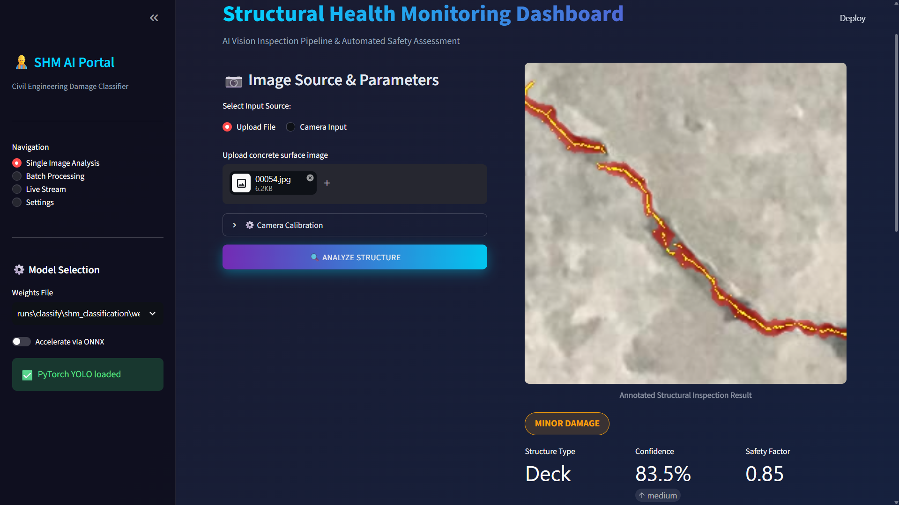
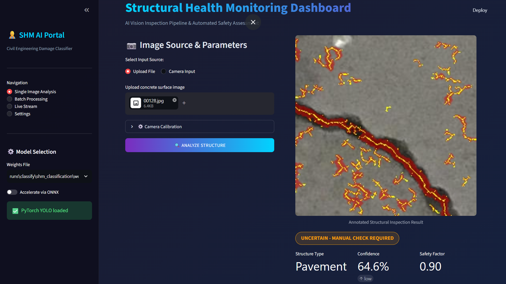

# SHM Vision — AI Structural Health Monitoring for Civil Infrastructure

<p align="center">
  
</p>

<p align="center">
  
  
  
  
  
  
  
</p>

AI-powered structural damage classification for civil infrastructure inspection.
Classifies cracks on **Deck**, **Pavement** and **Wall** surfaces with YOLOv8, measures
crack width photogrammetrically in millimetres, and grades each surface against
ACI 224R-01 / Eurocode 2 limits.

> **Read this before trusting a number.** `deck_cracked` recall is **0.70** on the
> held-out test split, so roughly 3 in 10 cracked decks are classified as healthy.
> See [Known limitations](#known-limitations). This project is an inspection aid,
> not a substitute for a qualified engineer's assessment.

---

## Contents

- [Features](#features)
- [Screenshots](#screenshots)
- [Sample reports](#sample-reports)
- [Tech stack](#tech-stack)
- [Project structure](#project-structure)
- [Quick start](#quick-start)
- [How to use](#how-to-use)
- [Safety thresholds](#safety-thresholds)
- [Classes](#classes)
- [Measurement accuracy](#measurement-accuracy)
- [Known limitations](#known-limitations)
- [Training](#training-optional)
- [Testing](#testing)
- [Camera calibration](#camera-calibration)
- [Output format](#output-format)
- [Author](#author)

---

## Features

- **6-Class Classification** — Deck / Pavement / Wall × Cracked / Uncracked, plus an
  optional `z_other` abstain class for out-of-scope images
- **Physical Crack Measurement** — Sub-pixel photogrammetric width in millimetres
  (integrated-intensity estimator, not a raw distance transform)
- **Honest reporting** — Sub-resolution cracks are reported as *unresolved* rather
  than assigned an invented width; a measured width can only escalate severity, never
  improve the safety factor
- **Safety Assessment** — Per-structure thresholds from ACI 224R-01 & Eurocode 2
- **Interactive Dashboard** — Streamlit app with red crack overlay and centreline
- **Export Reports** — PDF, JSON, CSV, each carrying the evidence quality
  (`confidence_tier`, `measurement_status`, `resolution_limited`)
- **Batch Processing** — Recursive multi-image pipeline with consolidated CSV
- **Live Stream** — Webcam / RTSP / video file with HUD overlay
- **CLI + Library** — `src/inference.py` handles single image, batch, video and stream

---

## Screenshots

**Confident detection.** A deck crack traced in red with its measured centreline in
yellow, graded `MINOR DAMAGE` at 83.5% confidence (safety factor 0.85). The fill
covers exactly the detected crack — it does not wash over the surrounding concrete.


**Low-confidence detection.** At 64.6% the classifier sits below the 0.75 decision
threshold, so the surface is flagged `UNCERTAIN — MANUAL CHECK REQUIRED` with a
reduced safety factor of 0.90 instead of being given a clean verdict.



The crack network is still fully marked even though the verdict is unresolved: an
inspector needs to see *where* the damage is, and the UI states plainly that the
*width* could not be trusted at that confidence.

---

## Sample reports

Two example PDF reports generated by the dashboard are in [`samples/`](samples/).
They are chosen to show the two distinct decision paths:

| File | Verdict | What it demonstrates |
|------|---------|----------------------|
| [`samples/shm_report_1.pdf`](samples/shm_report_1.pdf) | `pavement_cracked`, 82.6% → **CRITICAL**, SF 0.20 | A **valid measurement escalated the severity**: 23.70 mm measured against a 6.0 mm pavement critical limit, so the grade was raised rather than left at the baseline |
| [`samples/shm_report_2.pdf`](samples/shm_report_2.pdf) | `pavement_cracked`, 67.4% → **UNCERTAIN**, SF 0.90 | A **low-confidence verdict withheld the severity escalation**: the 22.25 mm width is reported for reference only, with the note *"severity not escalated: insufficient confidence/calibration resolution"* |

Each report contains the classification, confidence and confidence tier, the structure
type and condition status, the severity grade and safety factor, the ACI/Eurocode
thresholds applied, the camera calibration used, the measured crack geometry
(avg/max width, length, orientation), and an actionable engineering recommendation.

Note the second report: the condition status reads `UNCERTAIN` rather than `DAMAGED`.
The status line and the verdict badge always agree.

---

## Tech stack

| Layer | Technology |
|-------|-----------|
| Deep Learning | YOLOv8-cls (Ultralytics), PyTorch |
| CV / Measurement | OpenCV, NumPy, SciPy |
| Dashboard | Streamlit, Plotly |
| Reports | ReportLab (PDF), Pandas (CSV/JSON) |
| Evaluation | scikit-learn, matplotlib, seaborn |
| Standards | ACI 224R-01, EN 1992-1-1 (Eurocode 2) |

---

## Project Structure

```
Shm-Vision/
├── app.py                  # Streamlit dashboard
├── requirements.txt        # Python dependencies
├── README.md               # This file
├── USER_MANUAL.md          # User guide (English + Persian)
├── src/                    # Core library
│   ├── config.py           # Single source of truth: class maps, thresholds,
│   │                       #   severity ladder, measurement constants
│   ├── crack_measurement.py# Segmentation + sub-pixel photogrammetry
│   ├── eng_utils.py        # Civil engineering utilities & fleet rollups
│   ├── inference.py        # Classification pipeline (image/batch/video/stream)
│   └── train.py            # Model training script
├── scripts/
│   ├── prepare_data.py     # Dataset preprocessing (grouped split, no leak)
│   └── evaluate.py         # Accuracy, confusion matrix, calibration (ECE)
├── config/
│   ├── data.yaml           # Dataset configuration
│   └── hyperparams.yaml    # Training hyperparameters
├── tests/
│   ├── test_core.py        # pytest suite (57 checks)
│   └── run_all.py          # stdlib runner, no pytest needed (28 checks)
├── assets/                 # Screenshots embedded in this README
├── samples/                # Sample PDF reports produced by the dashboard
├── kaggle/                 # Kaggle training notebook + setup notes
└── .github/workflows/      # CI: both test suites on Python 3.10 and 3.12
```

---

## Documentation

- **User Manual** — Step-by-step guide (English + Persian)
  [📖 Read USER_MANUAL.md](USER_MANUAL.md)
- **Release notes** — what changed in v2.0 and why
  [📝 v2.0 release](https://github.com/PedramNikfajam/Shm-Vision/releases/tag/v2.0)

---

## Quick start

```bash
# 1. Clone the repository
git clone https://github.com/PedramNikfajam/Shm-Vision.git
cd Shm-Vision

# 2. Create an environment (Python 3.10 or 3.12)
python -m venv .venv
source .venv/bin/activate        # Windows: .venv\Scripts\activate

# 3. Install dependencies
pip install -r requirements.txt

# 4. Supply model weights  (see note below)

# 5. Launch the dashboard
streamlit run app.py
```

The app opens at `http://localhost:8501`.

### Step 4 is not optional

Model weights are **not committed** (`.gitignore` excludes `*.pt`). Without a weights
file the app starts in **Simulation Mode**, which returns a fixed placeholder
distribution — the results are *not* model predictions, and the sidebar says so.

Download the trained checkpoint attached to the
[v2.0 release](https://github.com/PedramNikfajam/Shm-Vision/releases/tag/v2.0):

```bash
# Download (2,979,464 bytes)
curl -L -O https://github.com/PedramNikfajam/Shm-Vision/releases/download/v2.0/best.pt

# Verify integrity
sha256sum best.pt
# 0fec9340c033b6889b3a66485bcc1ed1bc1765399763c0d125e6051e29b712bb
```

Then place it in **either** location — the sidebar auto-discovers both:

```
./best.pt
./runs/classify/shm_classification/weights/best.pt
```

| Property | Value |
|----------|-------|
| Architecture | YOLOv8-cls (`yolov8s-cls`, 256 px) |
| Classes | 6 — `deck_cracked`, `deck_uncracked`, `pavement_cracked`, `pavement_uncracked`, `wall_cracked`, `wall_uncracked` |
| Training data | SDNET2018, split grouped by surface (no train/test leak) |
| Top-1 accuracy | 0.8885 on 1363 held-out test images |
| Calibration | Expected Calibration Error 0.0198 |
| SHA-256 | `0fec9340c033b6889b3a66485bcc1ed1bc1765399763c0d125e6051e29b712bb` |

> ⚠️ That 0.89 top-1 hides a serious gap: `deck_cracked` recall is only **0.70**. See
> [Known limitations](#known-limitations) before using this on a real structure.

Prefer ONNX? The sidebar has an **Accelerate via ONNX** toggle that picks up a
sibling `best.onnx`; export one with `python src/train.py --export --weights best.pt --format onnx`.

---

## How to Use

### Single Image Analysis
1. Upload a concrete surface image (JPG/PNG) or use camera input
2. Set camera calibration parameters (distance & focal length)
3. Click **ANALYZE STRUCTURE**
4. View classification result, safety factor gauge, and engineering recommendation
5. Export report as PDF, JSON, or CSV

### Batch Processing
1. Navigate to **Batch Processing** in the sidebar
2. Upload multiple images
3. Run batch analysis
4. Download consolidated CSV report

### Live Stream
1. Navigate to **Live Stream**
2. Select source (Webcam / RTSP / Video File)
3. Start stream for real-time inspection

---

## Safety Thresholds

| Structure | Critical Crack | Max Allowable | Standard | Description |
|-----------|---------------|---------------|----------|-------------|
| **Deck** | 0.3 mm | 0.5 mm | ACI 224R-01 | Bridge deck or floor slab |
| **Pavement** | 6.0 mm | 12.0 mm | Eurocode 2 | Road or sidewalk pavement |
| **Wall** | 0.3 mm | 1.0 mm | ACI 224R-01 | Concrete or masonry wall |

---

## Classes

| ID | Class Name | Structure | Condition |
|----|-----------|-----------|-----------|
| 0 | deck_cracked | Deck | Cracked |
| 1 | deck_uncracked | Deck | Healthy |
| 2 | pavement_cracked | Pavement | Cracked |
| 3 | pavement_uncracked | Pavement | Healthy |
| 4 | wall_cracked | Wall | Cracked |
| 5 | wall_uncracked | Wall | Healthy |
| 6 | z_other *(optional)* | Out of scope | Abstain |

Class 6 is optional: put diverse non-structural photos in `data/raw/other/`
and re-run `prepare_data.py` (it becomes the `z_other` class — the `z_`
prefix keeps YOLO's alphabetical id mapping stable). The app then reports
OUT OF SCOPE instead of forcing a concrete verdict on random pictures.

---

## Measurement accuracy

Width is estimated with the **integrated-intensity** method rather than a raw
distance transform. `2 * dt` on an integer distance transform can only ever yield
*even* pixel widths, which made the estimator quantised and non-monotonic — a 1, 2, 3
and 4 px crack all measured `10.00 mm`, and an 8 px crack came out *narrower* than a
7 px one. The integrated-intensity form `w = Σ max(0, b − I) / (b − c)` conserves
intensity through the blur, so it is both blur-invariant and sub-pixel.

Measured against synthetic bars of known width at the default 2.5 mm/px calibration:

| True width | v1 reported | v2 reports | Error |
|-----------|-------------|------------|-------|
| 1 px (2.50 mm) | 10.00 mm | *resolution limited* | n/a — below the blur floor |
| 3 px (7.50 mm) | 10.00 mm | 8.72 mm | +16% |
| 4 px (10.00 mm) | 10.00 mm | 10.80 mm | +8% |
| 6 px (15.00 mm) | 15.00 mm | 15.12 mm | +1% |
| 8 px (20.00 mm) | 15.00 mm | 20.10 mm | +1% |
| 12 px (30.00 mm) | *rejected* | 30.10 mm | +0% |

Two rules keep the output defensible:

- **Resolution floor.** A crack narrower than the 5×5 blur kernel cannot be measured,
  so it is reported as *resolution limited* rather than given a plausible-looking but
  invented width. The floor is in pixels, so it does not change with calibration.
- **Scale-invariant width gate.** The old absolute `max_mean_width_px = 6.0` rejected
  every crack wider than ~6 px, which broke precisely where photogrammetry is most
  accurate: at 0.1 mm/px a 12 mm pavement crack is 120 px wide and was reported as
  *"no crack detected"*. The gate is now a fraction of the frame.

A measured width may **escalate** severity but never reduce it below the
conservative baseline, so measuring a crack can never improve its safety factor.

---

## Known limitations

**`deck_cracked` recall is 0.70.** On the held-out test split (1363 images, top-1
accuracy 0.89), 71 of 240 cracked decks are classified as `deck_uncracked`:

| True \ Predicted | deck_cracked | deck_uncracked |
|------------------|--------------|----------------|
| **deck_cracked** | 169 (70%) | **70 (29%)** |
| **deck_uncracked** | 10 (5%) | 204 (95%) |

Those 29% receive a `HEALTHY` verdict with a safety factor of 1.00. This is a
**model-capacity problem, not a reporting one**, and is not fixed in v2.

An ambiguity guard was evaluated and deliberately rejected. Flagging an `uncracked`
verdict whenever the matching `cracked` class holds meaningful probability recovers
~88% of the missed cracks — but also flags ~45% of genuinely healthy surfaces for
manual review:

| Guard threshold | Missed cracks recovered | Healthy images false-flagged |
|-----------------|------------------------|------------------------------|
| 0.05 | 95.8% | 64.9% |
| 0.10 | 88.5% | 45.0% |
| 0.20 | 57.3% | 24.4% |

That trades one class of wrong answer for another. Closing the gap requires
retraining (more capacity, targeted augmentation for hairline deck cracks), not a
post-processing threshold. See `config/hyperparams.yaml` for the notes from the last
training run.

**Other caveats**

- **Domain.** The model is trained on SDNET2018 (256 px close-up tiles). Photos far
  outside that domain are out-of-distribution; predictions below 75% confidence are
  flagged UNCERTAIN by design.
- **Flat surfaces only.** A single pinhole distance and focal length are assumed, so
  the method degrades on strongly oblique views.
- **Pavement recall is high but wall/deck width precision is not.** A measured width
  is only used for severity when the calibration can physically resolve the crack
  (`can_escalate_severity`); otherwise it is shown for reference only.

---

## Training (Optional)

If you want to train your own model:

```bash
# Prepare dataset (split is GROUPED by surface ID: no leak between train/val/test)
python scripts/prepare_data.py --raw data/raw/ --output data/processed/ --balance --max-per-class 2000 --clean

# Train (defaults from config/hyperparams.yaml: yolov8s-cls @ 320px)
python src/train.py --data data/processed

# Evaluate
python scripts/evaluate.py --weights runs/classify/shm_classification/weights/best.pt --data data/processed/test

# Export to ONNX
python src/train.py --export --weights best.pt --format onnx
```

---

## Testing

Two independent suites cover the same ground — use whichever you have installed.

```bash
# pytest (57 checks)
python -m pytest tests/test_core.py -q

# stdlib only, no pytest required (28 checks)
python tests/run_all.py
```

Neither suite needs `torch` or `ultralytics`, so CI stays fast and
dependency-light. The tests assert behaviour that was previously wrong, among others:

- severity is **monotonic in confidence** (there was a cliff at 0.85 where a *more*
  confident detection produced a *worse* safety factor)
- a measured width can never grade a crack **healthier** than leaving it unmeasured
- width is **monotonic in true width** (it used to be quantised and non-monotonic)
- a sub-blur-kernel crack is reported **unresolved**, not as a fabricated width
- wide cracks are **accepted at close range** (the old 6 px cap rejected them)
- the red overlay never paints **outside** the detected crack mask
- `confidence_tier == "low"` coincides exactly with the UNCERTAIN gate

CI runs both on Python 3.10 and 3.12:
[](https://github.com/PedramNikfajam/Shm-Vision/actions/workflows/ci.yml)

---

---

## Camera Calibration

For accurate physical measurements:

| Parameter | Default | Description |
|-----------|---------|-------------|
| Distance to Structure | 2000 mm | Camera-to-surface distance |
| Focal Length | 800 px | Camera focal length in pixels |

Calculate focal length from physical specs:
```python
focal_px = (image_width_px * focal_length_mm) / sensor_width_mm
```

**Resolution rule:** 1 px must cover at most ~1/3 of the element's
`max_allowable` width, or the measurement is rejected as untrusted
(e.g. wall: 1 px <= 0.33 mm). For phone photos: get close (~0.5 m) and
use the full-resolution image; the default 800 px focal at 2 m CANNOT
resolve 0.3 mm wall cracks -- widths reported there are texture noise,
shown for reference only and never used for severity.

---

## Output format

### PDF report

Two worked examples are in [`samples/`](samples/). Each contains:

- Original image with the crack overlay (red fill + yellow detected centreline)
- Classification result, confidence score and confidence tier
- Structure type and condition status
- Severity assessment and safety factor
- Engineering recommendation per ACI 224R-01 / Eurocode 2
- Camera calibration parameters

### JSON report (`schema_version` 2.0)

```json
{
  "schema_version": "2.0",
  "timestamp": "2026-09-25T21:30:46.939",
  "classification": {
    "class": "wall_cracked",
    "confidence": 0.9629,
    "confidence_tier": "high"
  },
  "assessment": {
    "structure_type": "wall",
    "condition": "DAMAGED",
    "severity": "minor",
    "safety_factor": 0.85,
    "critical_width_mm": 0.3,
    "max_allowable_mm": 1.0,
    "recommendation": "WALL EVALUATION: ..."
  },
  "measurement": {
    "performed": true,
    "status": "measured",
    "resolution_limited": false,
    "mm_per_px": 2.5,
    "avg_width_mm": 0.42,
    "max_width_mm": 0.61,
    "median_width_mm": 0.4,
    "p90_width_mm": 0.55,
    "length_mm": 184.0,
    "orientation_deg": 37.0,
    "n_components": 2,
    "message": "Crack measured: avg=0.420mm, ..."
  },
  "camera_params": { "dist": 2000, "focal": 800 }
}
```

`measurement.status` is one of `not_attempted`, `measured`, `unresolved` or
`rejected`. When it is `unresolved` the crack was located but is too thin for the
calibration to quantify — treat the width as unknown, not as `avg_width_mm`.

### CSV report

Single row: `Class, Confidence, ConfidenceTier, Status, Severity, SafetyFactor,
Structure, MeasurementStatus, MeasuredWidth_mm`. `MeasuredWidth_mm` is blank when no
width was accepted.

---

## Author

**Pedram Nikfarjam** — Civil Engineering + AI  
[GitHub](https://github.com/PedramNikfajam) • [Email](mailto:pedram.nikfarjam2004@gmail.com)

---

## License

MIT License — Civil Engineering Research
