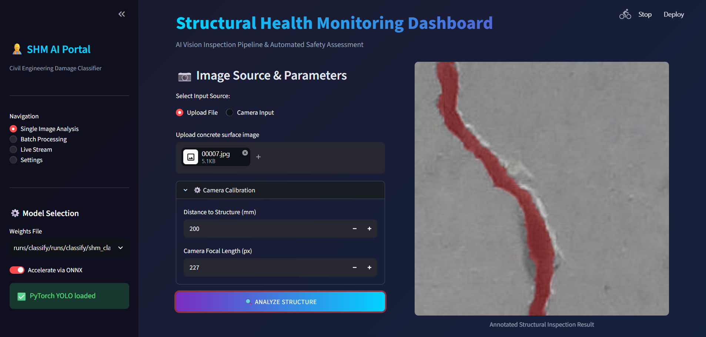

# SHM Vision — AI Structural Health Monitoring for Civil Infrastructure

<p align="center">
  
</p>

<p align="center">
  
  
  
  
  
</p>

AI-powered structural damage classification system for civil infrastructure inspection. Detects and measures cracks on **Deck**, **Pavement**, and **Wall** surfaces using deep learning (YOLOv8) and computer vision.

---

## Features

- **6-Class Classification** — Deck / Pavement / Wall x Cracked / Uncracked
- **Physical Crack Measurement** — Photogrammetric width estimation in millimeters
- **Safety Assessment** — Per-structure thresholds based on ACI 224R-01 & Eurocode 2
- **Interactive Dashboard** — Streamlit web app with real-time analysis
- **Export Reports** — PDF, JSON, CSV output with engineering recommendations
- **Batch Processing** — Multi-image inspection pipeline
- **Live Stream** — Webcam / RTSP / drone feed support

---

## Tech Stack

| Layer | Technology |
|-------|-----------|
| Deep Learning | YOLOv8 (Ultralytics) |
| CV / Measurement | OpenCV, NumPy, SciPy |
| Dashboard | Streamlit, Plotly |
| Reports | ReportLab (PDF), Pandas (CSV) |
| Standards | ACI 224R-01, Eurocode 2 |

---

## Project Structure

```
shm-vision/
├── app.py                  # Streamlit dashboard
├── requirements.txt        # Python dependencies
├── README.md               # This file
├── USER_MANUAL.md          # User guide (Persian + English)
├── src/
│   ├── config.py           # Safety thresholds & engineering constants
│   ├── crack_measurement.py# Crack detection & photogrammetric measurement
│   ├── eng_utils.py        # Civil engineering utilities
│   ├── inference.py        # YOLO classification pipeline
│   └── train.py            # Model training script
├── scripts/
│   ├── prepare_data.py     # Dataset preprocessing
│   └── evaluate.py         # Model evaluation & benchmarking
├── config/
│   ├── data.yaml           # Dataset configuration
│   └── hyperparams.yaml    # Training hyperparameters
└── assets/                 # Demo screenshots
```

---

## Documentation

- **User Manual** — Step-by-step guide (English + Persian)  
  [📖 Read USER_MANUAL.md](USER_MANUAL.md)

---

## Quick Start

```bash
# 1. Clone the repository
git clone https://github.com/YOUR_USERNAME/shm-vision.git
cd shm-vision

# 2. Install dependencies
pip install -r requirements.txt

# 3. Download YOLOv8 classification weights
# Place yolov8n-cls.pt or your trained best.pt in the project root

# 4. Launch the dashboard
streamlit run app.py
```

The app will open at `http://localhost:8501`

---

## How to Use

### Single Image Analysis
1. Upload a concrete surface image (JPG/PNG) or use camera input
2. Set camera calibration parameters (distance & focal length)
3. Click **ANALYZE STRUCTURE**
4. View classification result, safety factor gauge, and engineering recommendation
5. Export report as PDF, JSON, or CSV

### Batch Processing
1. Navigate to **Batch Processing** in the sidebar
2. Upload multiple images
3. Run batch analysis
4. Download consolidated CSV report

### Live Stream
1. Navigate to **Live Stream**
2. Select source (Webcam / RTSP / Video File)
3. Start stream for real-time inspection

---

## Safety Thresholds

| Structure | Critical Crack | Max Allowable | Standard | Description |
|-----------|---------------|---------------|----------|-------------|
| **Deck** | 0.3 mm | 0.5 mm | ACI 224R-01 | Bridge deck or floor slab |
| **Pavement** | 6.0 mm | 12.0 mm | Eurocode 2 | Road or sidewalk pavement |
| **Wall** | 0.3 mm | 1.0 mm | ACI 224R-01 | Concrete or masonry wall |

---

## Classes

| ID | Class Name | Structure | Condition |
|----|-----------|-----------|-----------|
| 0 | deck_cracked | Deck | Cracked |
| 1 | deck_uncracked | Deck | Healthy |
| 2 | pavement_cracked | Pavement | Cracked |
| 3 | pavement_uncracked | Pavement | Healthy |
| 4 | wall_cracked | Wall | Cracked |
| 5 | wall_uncracked | Wall | Healthy |

---

## Screenshots

<p align="center">
  
</p>

---

## Training (Optional)

If you want to train your own model:

```bash
# Prepare dataset
python scripts/prepare_data.py --raw data/raw/ --output data/processed/

# Train
python src/train.py --data data/processed --epochs 150 --imgsz 224

# Evaluate
python scripts/evaluate.py --weights runs/classify/shm_classification/weights/best.pt --data data/processed

# Export to ONNX
python src/train.py --export --weights best.pt --format onnx
```

---

## Camera Calibration

For accurate physical measurements:

| Parameter | Default | Description |
|-----------|---------|-------------|
| Distance to Structure | 2000 mm | Camera-to-surface distance |
| Focal Length | 800 px | Camera focal length in pixels |

Calculate focal length from physical specs:
```python
focal_px = (image_width_px * focal_length_mm) / sensor_width_mm
```

---

## Output Format

### PDF Report Includes:
- Original image with crack overlay (red highlight)
- Classification result & confidence score
- Structure type & condition status
- Severity assessment & safety factor
- Engineering recommendation per ACI/Eurocode
- Camera calibration parameters

### JSON Report:
```json
{
  "class": "wall_cracked",
  "confidence": 0.9629,
  "metrics": {
    "severity": "moderate",
    "safety_factor": 0.65,
    "status_text": "DAMAGED"
  },
  "camera_params": {"dist": 2000, "focal": 800}
}
```

---

## Author

**Your Name** — Civil Engineering + AI  
[LinkedIn](https://linkedin.com/in/yourprofile) • [Email](mailto:your@email.com)

---

## License

MIT License — Civil Engineering Research
